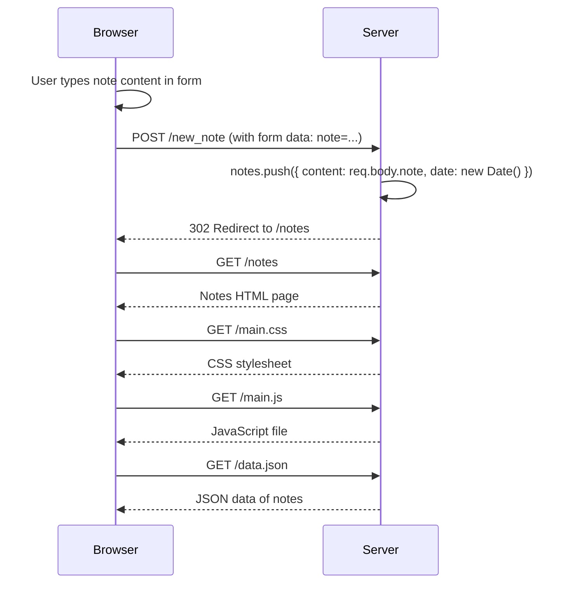
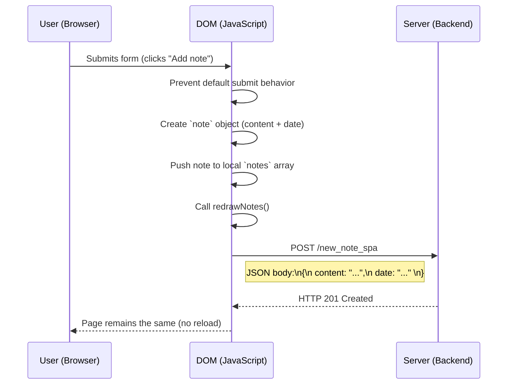
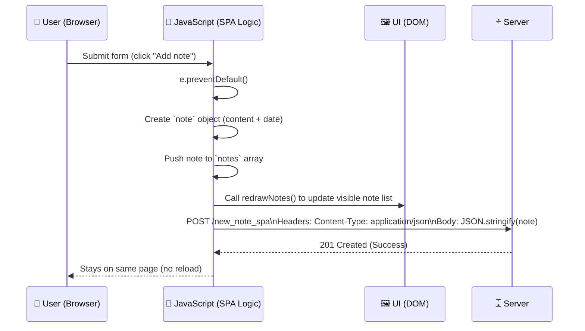

**New note diagram👇**

```mermaid
sequenceDiagram
    participant Browser
    participant Server

    Browser->>Browser: User types note content in form
    Browser->>Server: POST /new_note (with form data: note=...)
    Server->>Server: notes.push({ content: req.body.note, date: new Date() })
    Server-->>Browser: 302 Redirect to /notes
    Browser->>Server: GET /notes
    Server-->>Browser: Notes HTML page

    Browser->>Server: GET /main.css
    Server-->>Browser: CSS stylesheet

    Browser->>Server: GET /main.js
    Server-->>Browser: JavaScript file

    Browser->>Server: GET /data.json
    Server-->>Browser: JSON data of notes
```

**Single Page App diagram👇**

```mermaid
sequenceDiagram
    participant User as User (Browser)
    participant DOM as DOM (JavaScript)
    participant Server as Server (Backend)

    User->>DOM: Submits form (clicks "Add note")
    DOM->>DOM: Prevent default submit behavior
    DOM->>DOM: Create `note` object (content + date)
    DOM->>DOM: Push note to local `notes` array
    DOM->>DOM: Call redrawNotes()
    DOM->>Server: POST /new_note_spa
    Note right of DOM: JSON body:\n{\n  content: "...",\n  date: "..." \n}
    Server-->>DOM: HTTP 201 Created
    DOM-->>User: Page remains the same (no reload)
```

**New note in Single page app diagram👇**

```mermaid
sequenceDiagram
    participant User as 👤 User (Browser)
    participant JS as 🧠 JavaScript (SPA Logic)
    participant UI as 🖼️ UI (DOM)
    participant Server as 🗄️ Server

    User->>JS: Submit form (click "Add note")
    JS->>JS: e.preventDefault()
    JS->>JS: Create `note` object (content + date)
    JS->>JS: Push note to `notes` array
    JS->>UI: Call redrawNotes() to update visible note list
    JS->>Server: POST /new_note_spa\nHeaders: Content-Type: application/json\nBody: JSON.stringify(note)
    Server-->>JS: 201 Created (Success)
    JS-->>User: Stays on same page (no reload)
```

  
