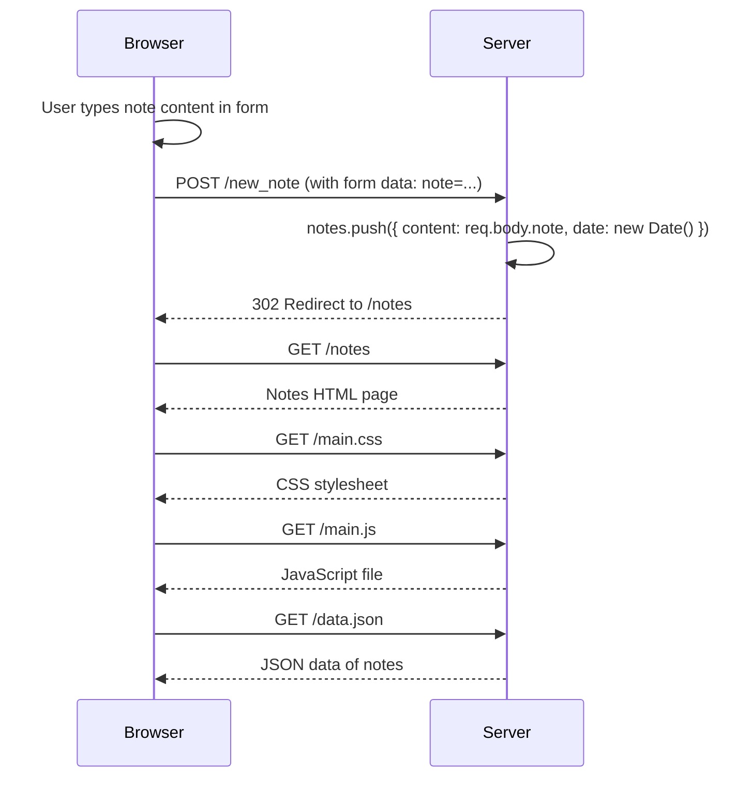

```mermaid
sequenceDiagram
    participant Browser
    participant Server

    Browser->>Browser: User types note content in form
    Browser->>Server: POST /new_note (with form data: note=...)
    Server->>Server: notes.push({ content: req.body.note, date: new Date() })
    Server-->>Browser: 302 Redirect to /notes
    Browser->>Server: GET /notes
    Server-->>Browser: Notes HTML page

    Browser->>Server: GET /main.css
    Server-->>Browser: CSS stylesheet

    Browser->>Server: GET /main.js
    Server-->>Browser: JavaScript file

    Browser->>Server: GET /data.json
    Server-->>Browser: JSON data of notes
```

  
